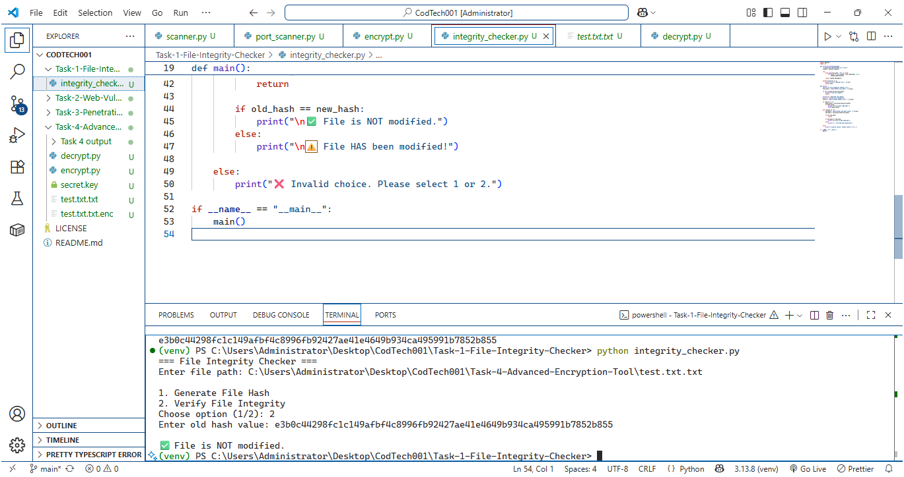

# Task 1: File Integrity Checker

## 📌 Objective
To verify whether a file has been modified by comparing cryptographic hash values.

## 🛠 Technologies Used
- Python
- hashlib
- os

## 📂 Files
- integrity_checker.py

## ⚙️ How It Works
- Generates a SHA-256 hash of a file
- Compares old and new hash values
- Detects file tampering

## ▶️ How to Run
1. Navigate to the folder:
   ```bash
   cd Task-1-File-Integrity-Checker
Enter the file path

Choose:

1 → Generate Hash

2 → Verify Integrity

📷 Output

The program displays whether the file is modified or not based on hash comparison.



🎯 Learning Outcome

Understanding hashing

File integrity monitoring

Basics of cybersecurity

🔐 Note

This project is developed for educational and internship purposes only.


---
