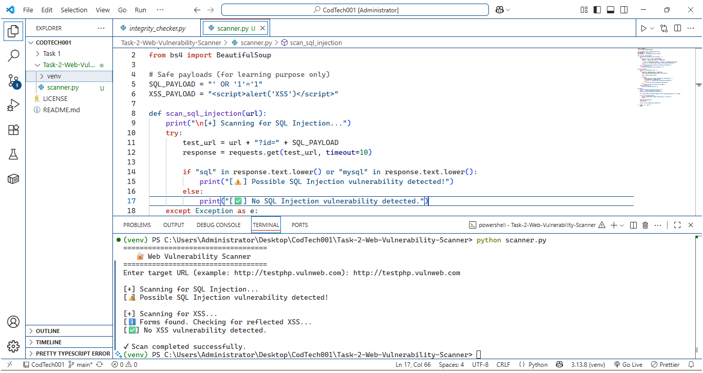

---

# ✅ README — Task 2  
## 📁 Task-2-Web-Vulnerability-Scanner

```md
# Task 2: Web Vulnerability Scanner

## 📌 Description
This project is a basic Web Vulnerability Scanner built using Python. It checks websites for common vulnerabilities such as SQL Injection and Cross-Site Scripting (XSS).

## 🛠 Technologies Used
- Python
- requests
- BeautifulSoup (bs4)

## 🚀 Features
- Detects possible SQL Injection vulnerabilities
- Detects possible XSS vulnerabilities
- Scans HTML forms safely
- Educational and ethical scanning

## ▶️ How to Run
1. Activate virtual environment (if available)
2. Run:
   ```bash
   python scanner.py
Enter target URL (example):

http://testphp.vulnweb.com

📷 Output

The scanner displays vulnerability status in the terminal.

## 📷 Output

The program compares file hashes to detect modifications.



🎯 Learning Outcome

Web security fundamentals

HTTP requests handling

HTML parsing

Vulnerability scanning basics

⚠️ Disclaimer

This tool is strictly for educational and internship learning purposes.