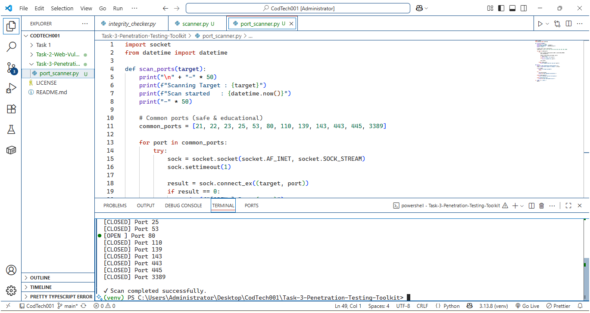

---

# ✅ README — Task 3  
## 📁 Task-3-Penetration-Testing-Toolkit

```md
# Task 3: Basic Penetration Testing Toolkit (Port Scanner)

## 📌 Description
This project is a simple Python-based Port Scanner that checks common network ports on a target system to identify open and closed ports.

## 🛠 Technologies Used
- Python
- socket
- datetime

## 🚀 Features
- Scans commonly used ports
- Displays open and closed ports
- Handles network errors safely
- CLI-based tool

## ▶️ How to Run
1. Navigate to the Task-3 folder
2. Run:
   ```bashEnter target domain or IP:

scanme.nmap.org

📷 Output

## 📷 Output
![Task-3-Penetration-Testing-Toolkitl(Task 3 output/output 1.png)


The program compares file hashes to detect modifications.

Screenshots of scan results are available in the Task 3 output folder.


🎯 Learning Outcome

Network scanning basics

Understanding open ports

Ethical penetration testing concepts

🔐 Note

This tool is intended only for educational and internship purposes
   python port_scanner.py
