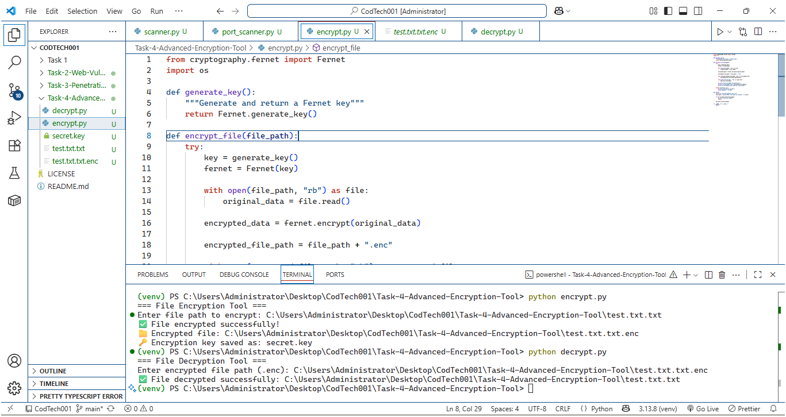

---

# ✅ README — Task 4  
## 📁 Task-4-Advanced-Encryption-Tool

```md
# Task 4: Advanced Encryption Tool

## 📌 Description
This project demonstrates file encryption and decryption using symmetric key cryptography (Fernet). It ensures data confidentiality by securely encrypting files.

## 🛠 Technologies Used
- Python
- cryptography (Fernet)
- os

## 🚀 Features
- Encrypt files securely
- Decrypt encrypted files
- Generates and stores encryption keys
- Secure file handling

## ▶️ How to Run

### 🔹 Encryption
```bash
python encrypt.py
Enter file name to encrypt.

🔹 Decryption
python decrypt.py


Enter encrypted .enc file.

📷 Output


Output screenshots are available in the Task 4 output folder.

🎯 Learning Outcome

Cryptography basics

Symmetric encryption

Secure data handling

🔐 Security Note

Keep secret.key safe. Loss of key will result in permanent data loss.

⚠️ Disclaimer

For educational and internship use only.